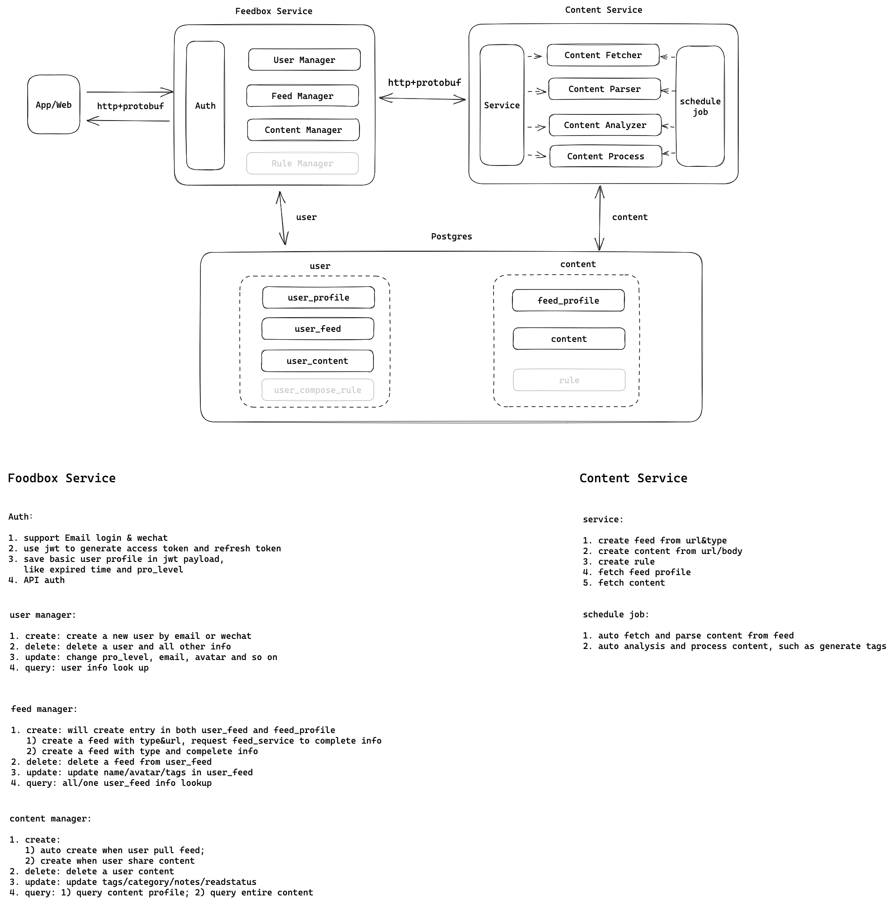

# 架构设计

- 主要内容: FeedBox产品整体架构设计
- Start Date: 2023-03-18

## Summary

整体架构设计，将feed内容拉取、内容解析、内容分析与处理模块单独抽出一个服务。将user相关和feed相关的数据库进行分离。

## Motivation

功能解耦，降低数据查询耦合度，逻辑更加清晰

## Guide-level explanation

## Reference-level explanation

TBD

## Drawbacks

网络带宽消耗会增加，因为多了一个服务。当然也可以部署到同一台机器。

## Rationale and alternatives

N/A

## Prior art

N/A

## Unresolved questions

TBD

## Future possibilities

TBD
